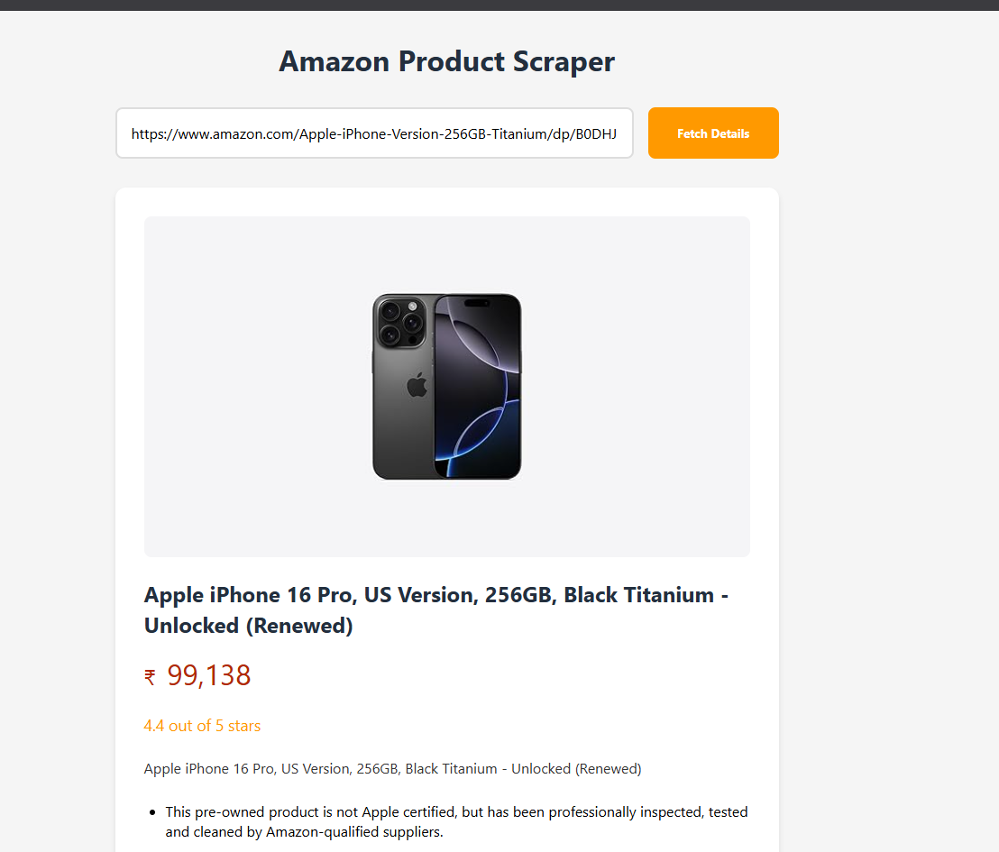

# 🕸️ Amazon Web Scraper 🛒 

Welcome to **Amazon Web Scraper** — your simple tool to collect product details from Amazon for learning and personal use.

---

## 📌 Features

* Product Titles
* Prices
* Ratings
* Product Links
* Output to CSV or JSON

---

## ⚙️ Tech Stack

* Python 3
* requests
* BeautifulSoup
* pandas
* lxml
* Selenium (optional)

---

## 🚀 Getting Started

1. Clone this repo:

```bash
git clone https://github.com/Ish45883/Amazon-Web-Scraper.git
cd Amazon-Web-Scraper
```

2. Install dependencies:

```bash
pip install -r requirements.txt
```

3. Run the scraper:

```bash
python scraper.py
```

---
##Demo 



## ⚠️ Disclaimer

* Educational use only
* Respect Amazon’s ToS and robots.txt
* Heavy scraping can block your IP

---


## 📜 License

MIT License

---

**Author:** [Ishan](https://github.com/Ish45883)
Credits: [Codedex](https://www.codedex.io/projects/web-scrape-amazon-with-beautiful-soup)
This file was written with the assistance of [OpenAI](www.chatgpt.com)
